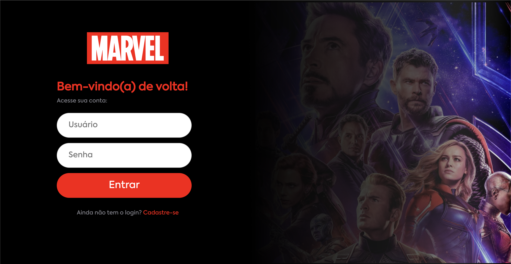

# Aplicativo Marvel

Bem-vindo ao Aplicativo Marvel! Este projeto é um aplicativo web que apresenta personagens, filmes e quadrinhos da Marvel com um design responsivo e uma experiência de usuário suave. Os usuários podem fazer login, visualizar detalhes sobre seus heróis, filmes e quadrinhos favoritos da Marvel e navegar por um carrossel de itens. O projeto é construído usando React, TypeScript, Styled Components, hooks personalizados e localStorage.

## Índice

- [Tecnologias Utilizadas](#tecnologias-utilizadas)
- [Estrutura do Projeto](#estrutura-do-projeto)
- [Hooks Personalizados](#hooks-personalizados)
- [Capturas de Tela](#capturas-de-tela)
- [Começando](#começando)

## Tecnologias Utilizadas

- **React**: Uma biblioteca JavaScript para construir interfaces de usuário.
- **TypeScript**: Um superset do JavaScript que adiciona tipagem estática.
- **Styled Components**: Uma biblioteca para estilizar componentes React usando literais de template marcados.
- **React Router**: Uma coleção de componentes de navegação que se compõem de forma declarativa com sua aplicação.
- **Slick Carousel**: Uma biblioteca de carrossel/slider para React.

## Estrutura do Projeto

O projeto está estruturado da seguinte forma:

```
src/
|-- assets/           # Recursos estáticos como imagens e fontes
|-- components/       # Componentes reutilizáveis
|   |-- common/       # Componentes comuns usados em diferentes views
|   |   |-- Header/   # Componente Header com navegação responsiva
|   |   |-- Layout/   # Componente Layout para layout de página consistente
|   |   |-- MainCard/ # Componente Card usado para exibir heróis, filmes e quadrinhos
|-- hooks/            # Hooks personalizados para buscar dados mock
|-- data/             # Dados mock para heróis, filmes e quadrinhos
|-- styles/           # Estilos globais e reutilizáveis
|-- views/            # Diferentes views da aplicação
|   |-- Home/         # View Home exibindo heróis
|   |-- Login/        # View Login para autenticação de usuário
|   |-- Movies/       # View Movies exibindo filmes da Marvel
|   |-- Comics/       # View Comics exibindo quadrinhos da Marvel
|-- App.tsx           # Componente principal da aplicação
|-- index.tsx         # Ponto de entrada da aplicação
```

## Hooks Personalizados

O projeto utiliza hooks personalizados para buscar e gerenciar dados mock para heróis, filmes e quadrinhos:

- **useMockHeroes**: Busca dados mock para heróis da Marvel.
- **useMockMovies**: Busca dados mock para filmes da Marvel.
- **useMockComics**: Busca dados mock para quadrinhos da Marvel.

Esses customHooks usam os hooks `useState` e `useEffect` para simular a busca de dados de uma API, proporcionando uma experiência realista de busca de dados, além de deixar o código organizado e escalavel.

## Capturas de Tela

### Tela de Login



### Dashboard


### Modal Aberto


### Dashboard Mobile


### Modal Aberto Mobile


## Começando

Para começar com o projeto, siga estes passos:

1. **Clone o repositório**:

   ```sh
   git clone https://github.com/joaolrocha/avengers-project.git
   ```

2. **Navegue até o diretório do projeto**:

   ```sh
   cd avengers-project
   ```

3. **Instale as dependências**:

   ```sh
   npm install
   ```

4. **Inicie o servidor de desenvolvimento**:

   ```sh
   npm start
   ```

5. **Abra seu navegador** e navegue para `http://localhost:3000`.

## Conclusão

Este projeto do Aplicativo Marvel demonstra um design responsivo e o uso de várias tecnologias modernas da web para criar uma experiência de usuário suave e interativa. Sinta-se à vontade para explorar o código-fonte e personalizá-lo conforme suas necessidades.

---

Para quaisquer perguntas ou sugestões, sinta-se à vontade para entrar em contato.
